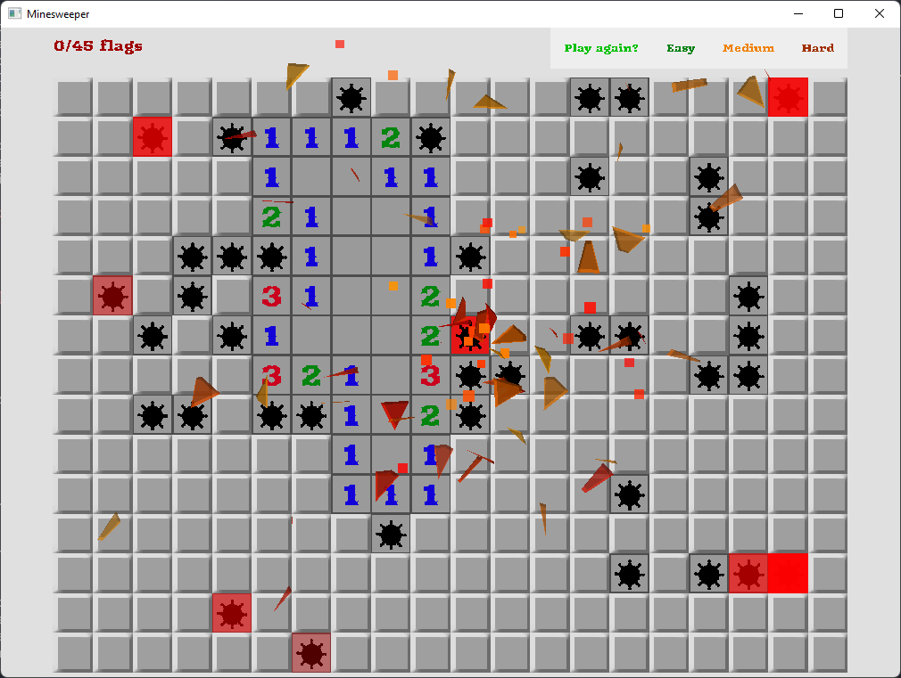

## MineSector

Pretty classic Minesweeper. Web Demo deployed [here](https://grassdne.github.io/minesector/)!



This uses only [SDL2](https://www.libsdl.org/) and extension libraries [SDL_image](https://wiki.libsdl.org/SDL_image/), [SDL_ttf](https://wiki.libsdl.org/SDL_ttf/), and [SDL_mixer](https://wiki.libsdl.org/SDL_mixer/).

Built on Unix with Clang or GCC and Windows with MinGW. 

## Unix Installation
1. Install SDL2 (minimum version 2.0.18), SDL_image, SDL_ttf, and SDL_mixer development packages, (and CMake).

  MacOS [Homebrew](https://brew.sh/):
  ```console
  $ brew install sdl2 sdl2_image sdl2_ttf sdl2_mixer cmake
  ```
  Ubuntu 22.04:
  ```console
  $ sudo apt install libsdl2-dev libsdl2-ttf-dev libsdl2-mixer-dev libsdl2-image-dev cmake
  ```
  Fedora:
  ```console
  $ sudo dnf install SDL2-devel SDL2_image-devel SDL2_ttf-devel SDL2_mixer-devel cmake
  ```
  
2. Build source code
```console
$ git clone https://github.com/grassdne/minesector.git
$ cd minesector
$ ./configure
$ make -j
$ sudo make install
$ minesector
```
./configure is currently equivalent to running `cmake -DCMAKE_BUILD_TYPE=Release`. To specify an installation location, set -DCMAKE_INSTALL_PREFIX in the configure step:
```console
$ ./configure -DCMAKE_INSTALL_PREFIX=./build
```
To run the program without `make install`, you must set the MINERUNTIME environment variable to the source directory so it knows where to find assets. Inside the git repo:
```console
$ MINERUNTIME="" ./minesector
```
The `-j` argument to `make` just tells make to run in parallel and is not required.
